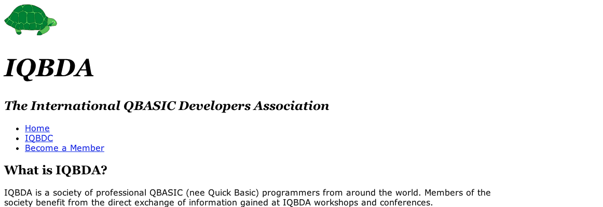
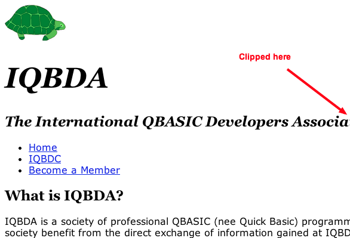
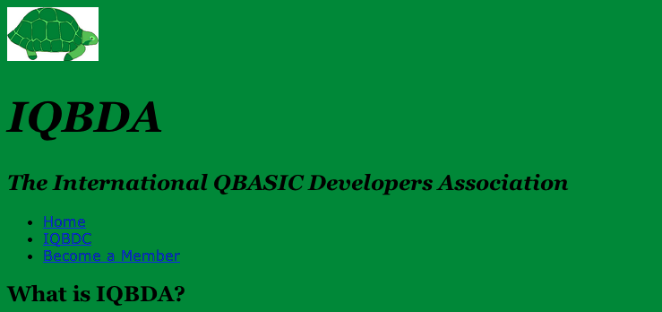
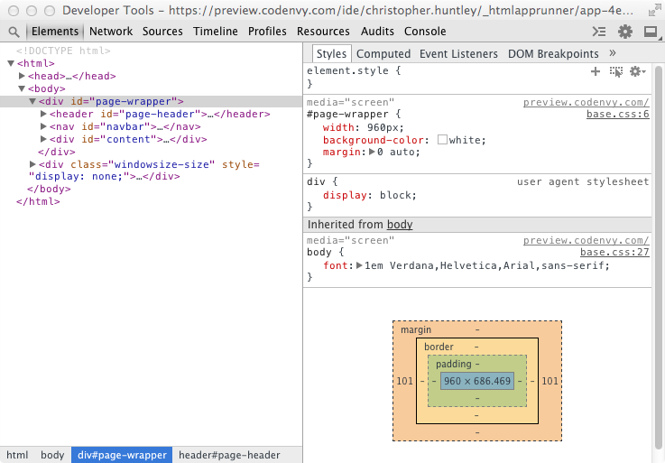
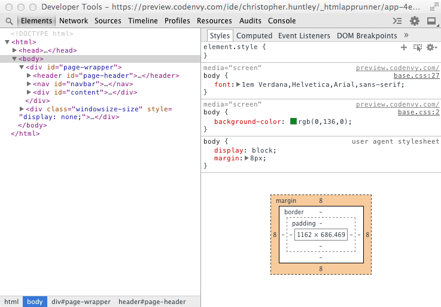
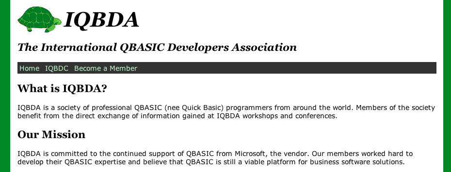
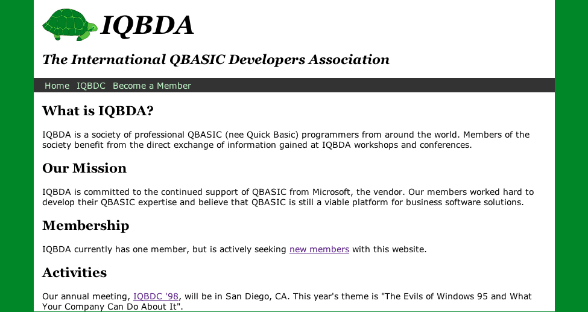

# IQBDA Part 5: Navbar and Page Layout

## Objectives
* Create a fixed width layout with colored sidewalls
* Align images with text
* Learn about `display:inline` vs `display:line-block` vs `display:block`
* Introduce basics of box models

**1. Correct your `base.css` file.**  
Make sure your stylesheet exactly matches the following:

```css
body {
  font: 1em Verdana,Helvetica,Arial,sans-serif;
}

#page-header h1 {
  font: bold italic 3em "Georgia", "Times",serif;
}
#page-header h2 {
  font: bolder italic 1.5em "Georgia", "Times",serif;
}
```

**2. Create an old-school fixed-width layout.**  
* Open `base.css` for editing. Also, open the page in a web browser so you can view the page
full-width.
* Just below the `body` rule,  set the width of the page wrapper to 960px.
  ```css
  body {
    font: 1em Verdana,Helvetica,Arial,sans-serif;
  }

  #page-wrapper {
    width:960px;
  }
  ```

  > For now, we’ll use a fixed width page, though we will revisit this decision in another session.

* Refresh your browser. If you resize your browser window to greater than 960px width, then you’ll see the whole page flush with the left-hand-side of the viewport.

  

  It stays there regardless of the width of the browser window. If you resize the window to less than 960 pixels wide then you’ll see the right side of the page get clipped off. That’s okay for now, though it is certainly inconvenient for folks using mobile devices.

  

* To make it easier to see the edges of the page, set the `background-color` of the `body` to `rgb(0,136,0)`.
  ```css
  body {
    font: 1em Verdana,Helvetica,Arial,sans-serif;
    background-color: rgb(0,136,0);
  }
  ```

* Refresh your browser to see what it looks like. Oops. It looks like background-color is an *inherited* property. If we set the background of the `body` then it gets inherited by the `#page-wrapper`.
  

* Set the background color of the `#page-wrapper` to white.
  

 >That’s a little better, though the page seems a bit off-center. Also, the little green strip along the top seems wrong.

* To recenter the page, set the margins of the `#page-wrapper` to use 0 margin on top and bottom and `auto` margin on left and right. Do it with one line of CSS using a 2-value (TB LR) directional shortcut. Use a comment to remind yourself how the directional shortcut works.

  ```css
  #page-wrapper {
    width:960px;
    background-color: white;
    margin: 0 auto; /* TB LR */
  }
  ```

  >Recall that `auto` margin expands to fill the available space. By doing it on both sides we effectively center the `#page-wrapper` within the page body. This rule also sets the top and bottom margin to zero.

* Now the page wrapper is centered but there is still a problem at the top of the page.
  

* Use Firebug or Chrome Developer Tools to get a peek at the `#page-wrapper` element’s box dimensions.
  

  > It looks like there is no top margin or padding for the #page-wrapper. The problem must with the body element.

* Inspect the `body` element to see its box dimensions.
  

  There seems to be 8px margin all around for the body (which seems kind of nonsensical given that the body is the window viewport; how can it have margin?), but we can reset it to 0 by editing our CSS. While we’re at it, let’s set the padding to 0 as well.
  ```css
  body {
    font: 1em Verdana,Helvetica,Arial,sans-serif;
    background-color: rgb(0,136,0);
    margin: 0;
    padding: 0;
  }
  ```

  Now that's better:
  

**3. Fix the text-image alignment in the masthead.**

The next item is the turtle logo and the “IQBDA” in the masthead. They should be side-by-side, aligned vertically, like this:  
  

We'll need to make several small CSS rules to fix it.

* To get the text and the image to appear side-by-side, let’s change the `display` of “IQBDA” to `inline-block`, just like the turtle image:

  ```css
  #page-header h1 {
    font: bold italic 3em "Georgia", "Times",serif;
    display: inline-block;
  }
  ```

  That gets us a little closer, but the alignment is wrong:  
  

* To be sure that there is no margin causing problems (the default vertical margin for an `h1` is `2em` in Chrome), set the `margin` of “IQBDA” to 0.

  ```css
  #page-header h1 {
    font: bold italic 3em "Georgia", "Times",serif;
    display: inline-block;
    margin: 0;
  }
  ```

  >There’s no apparent change in Preview, but at least we know that margins are not the problem.

* Now that the “IQBDA” is an inline-block, we can use text alignment properties to line it up with other inline or inline-block elements. The one we want is `vertical-align`, which should be set to `middle`.

  ```css
  #page-header h1 {
    font: bold italic 3em "Georgia", "Times",serif;
    display: inline-block;
    margin: 0;
    vertical-align: middle;
  }
  ```

  > That doesn't have any effect either! Ugh.

* Before we give up, let’s try setting the vertical-align of the logo as well:
  ```css
  #page-header img {
    vertical-align: middle;
  }
  ```

  > This new rule belongs just *above* the rule for `#page-wrapper h1` because the logo comes first in the HTML.

  That worked:

  

**4. Make the the `#navbar  look more like a minimal horizontal navbar.**

The current menu is shown as an unordered list of links. We'll need to display the links horizontally without the bullets and with a dark background to make them stand out.

* At the bottom of the stylesheet, change the `display` of the list items to `inline-block` so that they display horizontally.

  ```css
  #navbar ul li {
    display: inline-block;
  }
  ```

  The menu bar looks okay except that it has lots of left padding:

  

* Set the padding of the list (but not the list items) to 0.

  ```css
  #navbar ul {
    padding:0;
  }

  #navbar ul li {
    display: inline-block;
  }
  ```

  

* To really make it stand out, let’s give the #navbar a dark gray background color (`#333`, which is the same as `#333333`) to it so that it looks more like a menu bar.

  ```css
  #navbar {
    background-color: #333;
  }

  #navbar ul {
    padding:0;
  }
  ```

  

  >Hmmm. It looks like we need to change the color of the menu links. While we’re at it, we should take out the underlines.

* Set the text color to light-green (`#CCFFCC`, which is also `#CFC`). Also, set the `text-decoration` to `none`.

  ```css
  #navbar {
    background-color: #333;
  }

  #navbar a {
    color: #ccffcc;
    text-decoration:none;
  }

  #navbar ul {
    padding:0;
  }
  ```

  Now at least we can read the text:

  

* Add `0.25em` of padding to the links so they don't look so crowded.

  ```css
  #navbar a {
    color: #ccffcc;
    text-decoration:none;
    padding: 0.25em;
  }
  ```

  

  >The result looks better but there is not enough vertical padding. Because the links are considered text they are displayed `inline` and thus have not top or bottom padding.

* Change the `display` of the links to `inline-block`.
  ```css
  #navbar a {
    color: #ccffcc;
    text-decoration:none;
    padding: 0.25em;
    display:inline-block;
  }
  ```

  The top and bottom padding works now.

  

**5. Use a Pseudo-Class to make the links appear clickable.**

While the navbar looks okay in the screenshot, it lacks any kind of indication that its clickable. Let’s add a `:hover` pseudo-class to the menu links to make them a little more interactive.

* To outline clickable area of the link, set the background color on hover to `#666` (about twice as bright as `#333`) and add the slight text-shadow as shown below.  

  ```css
  #navbar a:hover {
    background-color: #666;
    text-shadow: 2px 2px #333;
  }
  ```

  When you preview the page, now the links “depress” to show that they are clickable.

**6. Add some padding all around the page.**  
There is one more minor tweak to make before we’re done. The whole page seems kind of crowded, with the logo flush against the green of the page margin.

* Add a `1em` padding to the `#page-wrapper`:
  ```css
  #page-wrapper {
    width:960px;
    background-color: white;
    margin: 0 auto; /* TB LR */
    padding:1em;
  }
  ```

  The padding looks nice except that now the '#navbar` doesn’t span the page anymore. That’s because it’s inside the `#page-wrapper` padding.

  

* **Take out the padding in the `#page-wrapper`.** Instead add `1em` left-right padding (and zero top-bottom padding) to `#page-header`, `#content`, and `#navbar`. Use a grouped selector so that you style all three at once.

  ```css
  #page-header, #content, #navbar {
    padding: 0 1em;
  }

  #page-header img {
    vertical-align: middle;
  }
  ```

  

  That's better, but we still have a little crowding along the top of the page.

* Add `1em` padding to the top of the `#page-header` to keep the logo from hitting the top of the page.

  ```css
  #page-header, #content, #navbar {
  padding: 0 1em;
  }

  #page-header {
  padding-top: 1em;
  }
  ```

  The final layout is like this:

  

**7. Save your work.**  
Commit and sync your changes to GitHub. Use the commit summary 'Part 5 complete'.
