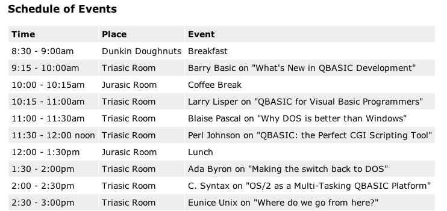
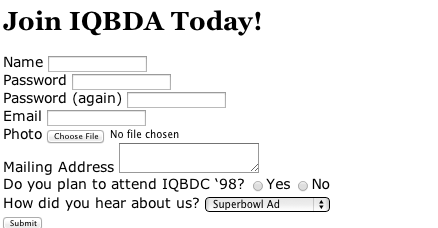
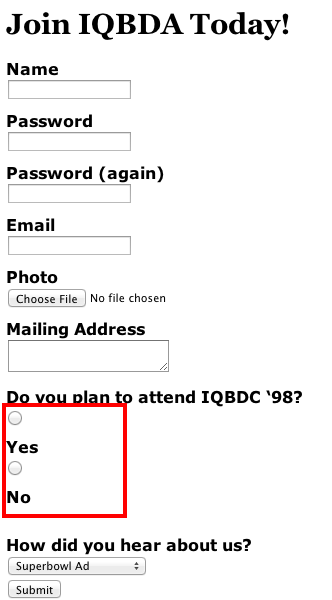
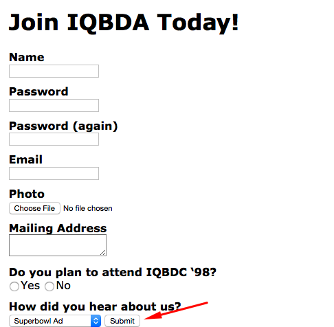

# IQBDA Part 6: Finishing Touches

## Objectives
* Learn about containing blocks for absolute positioning.
* Add styling to a basic HTML table.
* Style a form to make it easier to use.
* Use viewport sizing to fit the page to the device.

**1. Add a login link.**  
  In a previous session we created a signup form for the site that included a password. This would imply that there must be some way to log in! So, let’s add a nav menu called “user-links” to the bottom of the `#page-header` in the HTML source. We’ll assume that the URL for the login page is “login” since we don’t know what it is for sure yet.

* Open `index.html` in Atom.
* Edit the `#page-header` to insert the nav link:

  ```html
  <header id="page-header">
    
    <h1>IQBDA</h1>
    <h2>The International QBASIC Developers Association</h2>
    <nav id="user-links"><a href="login">Login</a></nav>
  </header>
  ```

* To keep all the pages in sync, also add the link to the `#page-header` in `iqbdc.html` and `member.html`.
* Open the page in Chrome or Firefox. The login link looks a bit out of place there; let’s see if we can move it to the top-right corner of the page.

  

  The easiest way to move the link exactly where we want is with absolute positioning. Here’s the CSS to put into the `base.css` file:
  ```css
  #user-links {
    position: absolute;
    top: 10px;
    right: 15px;
  }
  ```

  > The new rule belongs immediately below the `#page-header h2` rule. That's the spot that best corresponds to the link's position in the HTML document.

* Refresh your browser. Unfortunately, the link doesn’t seem to want to stay inside the `#page-header`. It spills over into the page margin.

  

  The problem is that *positioning offsets* (`top` and `right` here) are always with respect to a *containing block*, which in this case is the **full viewport**. If we stretch the browser window we’ll see that link staying put, right against the right edge of the viewport. To keep it contained within the `#page-header` we’ll need to apply relative positioning to the `#page-header`, which will then make it a containing block for `#user-links`.
  > Make 100% sure you understand that last part. Containing blocks are a critical concept in CSS positioning. Knowing how they work will make everything else so much easier.

  We can make `#page-header` a containing block by adding a declaration to the existing rule:
  ```css
  #page-header {
    padding-top: 1em;
    position:relative;
  }
  ```

  The link is now contained by the `#page-header`:

  

* Style the link to dark green to match the rest of the color scheme:
  ```css
  #user-links a {
    color: darkgreen;
  }
  ```

* To distinguish the login link from content links (i.e., within the content), remove the underline:
  ```css
  #user-links a {
    color: darkgreen;
    text-decoration: none;
  }
  ```

* Finally, to make it clearer that the text is a link, restore the underline on hover:
  ```css
  #user-links a:hover {
    text-decoration: underline;
  }
  ```

* Refresh your browser and check your work.

**2. Clean up the table styling.**  

The table on the `iqbdc.html` page is pretty hard to read, with all the text crammed in there so tight. We'll fix that will a few minimal CSS rules to add some padding (6px all around) to every `th` and `td` and, just for fun, add a light gray background to every other table row. We’ll add the rules to the bottom of the `base.css` file and use them for every table we might ever want on the site.

* Add the padding to the table cells:

  ```css
  th, td {
    padding: 6px;
  }
  ```

  > We used a grouped selector (i.e., with a comma) so that the rule applies to both `th` and `td` elements. If we'd left out the comma then it would have been a descendant selector for `td` elements inside of `th` elements.

* Add the background light gray color to just the odd rows of the table:
  ```css
  tr:nth-child(odd) {
    background-color: #eee;
  }
  ```

  > The `:nth-child()` pseudo-class accepts and argument to specify which of the children it applies to. In this case, we chose the `odd` children. The book covers lots of over cases. Can can, for example, select every fourth row or even the ones in the Fibonacci sequence.

* Refresh your browser and check your work.

  


**3. Style registration form.**  

We’ll conclude with some light styling to the form on the member.html page. While the form worked fine, the layout was pretty rough, with inconsistent alignments and drab-looking labels:

  

*  Add a CSS rule that makes the labels bold and displayed as blocks with 10px top margin:

  ```css
  label {
    font-weight: bold;
    display: block;
    margin-top: 10px;
  }
  ```

  By displaying them as blocks, the form controls are pushed to the next line. That looks great, except for the radio buttons:

  

  >The problem is that we’re using labels for each of the radio buttons. Rather than remove the labels, which provide a usability advantage because the user can click the word to select the button, we'll instead style them separately.

* Use a sibling selector (with + sign) to remove the block styling for label elements that immediately follow input elements of `type` radio or checkbox:

  ```css
  input[type=radio] + label, input[type=checkbox] + label {
      font-weight: normal;
      display:inline;
    }
  ```

  We're almost done. We just need to do something about the submit button and maybe add some whitespace at the bottom of the form.  

  

* Use a type selector to make the submit button display as a block and add some vertical spacing.
  ```css
  input[type=submit] {
    display:block;
    margin: 15px 0;
  }
  ```

  

**4. Fix the page height.**  

 It looks like the `#page-wrapper` (i.e., the white background) is not expanding to fit the bottom margin on the submit button.

* Set the height of the `#page-wrapper` to 100%, which will make it expand to fit the entirety of the page content:

  ```css
  #page-wrapper {
    width:960px;
    background-color: white;
    margin: 0 auto; /* TB LR */
    height: 100%;
  }
  ```

  

  > Hmmm. It looks like when the viewport (browser window) is taller than the page, we get a green strip along the bottom. Let's eliminate that while we're here.

* Set the minimum height of the `#page-wrapper` to `100vh`, which is 100% of the viewport. This, when combined with setting the height to 100% of the content, will eliminate the green strip entirely.

  ```css
  #page-wrapper {
    width:960px;
    background-color: white;
    margin: 0 auto; /* TB LR */
    height: 100%;  
    min-height: 100vh;
  }
  ```

  

  > `vh` and `vw` units are relatively new in CSS3. They were added to make it easier to fill mobile screens. [They work on just about anything except old versions of Internet Explorer.](http://caniuse.com/#feat=viewport-units)

  We could do more, like add a footer to make the page not look so imbalanced, but we'll call this done!

**5. Save your work.**  
Commit and sync your changes to GitHub. Use the commit summary 'IQBDA project complete'.
