# StagUp Bootstrap, Part 7: Debugging with Dev Tools

> One of the dark arts of web development is using the Chrome's Developer Tools
to inspect and edit code directly in the browser. In this short tutorial we will
use the Developer Tools to make minor adjustments to the source code.
Along the way we will try to get a better handle on how Bootstrap does its magic.

## Objectives
* Use Chrome's Developer Tools to debug HTML, CSS, and Javascript
* Gain a better understanding of Bootstrap's CSS framework

**1. Refresh your HTML.**  

By now there is a reasonable chance that you've FUBARed the `index.html` file.
Just to be sure the HTML is right, refresh your copy with the following:

```html
<!DOCTYPE html>
<html lang="en">
  <head>
    <meta charset="utf-8">
    <meta http-equiv="X-UA-Compatible" content="IE=edge">
    <meta name="viewport" content="width=device-width, initial-scale=1">
    <!-- The above 3 meta tags *must* come first in the head; any other head content must come *after* these tags -->
    <title>Bootstrap 101 Template</title>

    <!-- Bootstrap -->
    <link rel="stylesheet" href="https://maxcdn.bootstrapcdn.com/bootstrap/3.3.5/css/bootstrap.min.css">

    <!-- Custom Styling -->
    <link rel="stylesheet" href="assets/css/styles.css">

    <!-- HTML5 shim and Respond.js for IE8 support of HTML5 elements and media queries -->
    <!-- WARNING: Respond.js doesn't work if you view the page via file:// -->
    <!--[if lt IE 9]>
      <script src="https://oss.maxcdn.com/html5shiv/3.7.2/html5shiv.min.js"></script>
      <script src="https://oss.maxcdn.com/respond/1.4.2/respond.min.js"></script>
    <![endif]-->
  </head>
  <body>
    <div class="container-fluid">
      <header class="masthead row">
        <!-- Navbar Start -->
        <nav class="navbar navbar-inverse">
          <div class="container-fluid">
            <!-- Brand and toggle get grouped for better mobile display -->
            <div class="navbar-header">
              <button type="button" class="navbar-toggle collapsed" data-toggle="collapse" data-target="#bs-example-navbar-collapse-1" aria-expanded="false">
                <span class="sr-only">Toggle navigation</span>
                <span class="icon-bar"></span>
                <span class="icon-bar"></span>
                <span class="icon-bar"></span>
              </button>
              <a class="navbar-brand" href="#"></a>
            </div>

            <!-- Collect the nav links, forms, and other content for toggling -->
            <div class="collapse navbar-collapse" id="bs-example-navbar-collapse-1">
              <ul class="nav navbar-nav">
                <li class="active"><a href="#teams">Teams <span class="sr-only">(current)</span></a></li>
                <li><a href="#investors">Investors</a></li>
              </ul>
            </div><!-- /.navbar-collapse -->
          </div><!-- /.container-fluid -->
        </nav>
        <!-- Navbar End -->
      </header>
      <section class="feature-panel">
        <div class="featured-events-top row">
          <div class="featured-text-container col-sm-8 col-sm-offset-4 col-md-6 col-md-offset-6">
            <h1>Event Title</h1>
            <h2>Event Date</h2>
            <h2>Event Location</h2>
            <h3>Event Tagline</h3>
            <p class="lead">Lorem ipsum dolor sit amet, consectetur adipiscing elit. Maecenas erat ligula, vulputate sit amet tristique sed, cursus eget ante. Cras a neque in lorem vehicula vulputate. Nam justo velit, iaculis et mauris at, fringilla sagittis diam. Phasellus dignissim tempus lacus et iaculis. Integer eu nisi iaculis, pellentesque nunc ac, finibus nunc.</p>
            <a href="#" class="btn btn-primary btn-lg btn-block">Reserve Your Seat</a>
          </div>
        </div>
        <div class="featured-events-bottom row">
          <div class="featured-event-teaser col-md-3 col-sm-6">
            <h1>Event #1 Title</h1>
            <h2>Event #1 Date</h2>
            <h3>Event #1 Tagline</h3>
          </div>
          <div class="featured-event-teaser col-md-3 col-sm-6">
            <h1>Event #2 Title</h1>
            <h2>Event #2 Date</h2>
            <h3>Event #2 Tagline</h3>
          </div>
          <div class="featured-event-teaser col-md-3 col-sm-6">
            <h1>Event #3 Title</h1>
            <h2>Event #3 Date</h2>
            <h3>Event #3 Tagline</h3>
          </div>
          <div class="featured-event-teaser col-md-3 col-sm-6">
            <h1>Event #4 Title</h1>
            <h2>Event #4 Date</h2>
            <h3>Event #4 Tagline</h3>
          </div>
        </div>
      </section>
      <div class="row">
        <main class="main-content col-md-9">
          <div id="teams" class="panel panel-primary">
            <div class="panel-heading">
              <h1 class="panel-title">
                Teams
              </h1>
            </div>
            <div class="panel-body">
              <div class="row">
                <!-- start first team -->
                <div class="col-md-6">
                  <div class="team-profile media">
                      <div class="media-left">
                        <a href="#">
                          
                        </a>
                      </div>
                      <div class="media-body">
                        <h4 class="media-heading">Lorem Ipsum</h4>
                        <p>Lorem ipsum dolor sit amet, consectetur adipiscing elit. Velut ego nunc moveor. Et hunc idem dico, inquieta sed ad virtutes et ad vitia nihil interesse. Ut aliquid scire se gaudeant? Est enim effectrix multarum et magnarum voluptatum. Ergo, si semel tristior effectus est, hilara vita amissa est? Sed virtutem ipsam inchoavit, nihil amplius. Duo Reges: constructio interrete. An hoc usque quaque, aliter in vita? </p>
                      </div>
                  </div>
                </div>
                <!-- end first team -->

                <!-- start second team -->
                <div class="col-md-6">
                  <div class="team-profile media">
                      <div class="media-left">
                        <a href="#">
                          
                        </a>
                      </div>
                      <div class="media-body">
                        <h4 class="media-heading">Nihil Opus</h4>
                        <p>Nihil opus est exemplis hoc facere longius. Atqui iste locus est, Piso, tibi etiam atque etiam confirmandus, inquam; At iste non dolendi status non vocatur voluptas. Tubulo putas dicere? Tubulum fuisse, qua illum, cuius is condemnatus est rogatione, P. Unum nescio, quo modo possit, si luxuriosus sit, finitas cupiditates habere. Sin te auctoritas commovebat, nobisne omnibus et Platoni ipsi nescio quem illum anteponebas? Verum hoc idem saepe faciamus. Inscite autem medicinae et gubernationis ultimum cum ultimo sapientiae comparatur. </p>
                      </div>
                  </div>
                </div>
                <!-- end second team -->

              </div>
            </div>
          </div>

          <div id="investors" class="panel panel-primary">
            <div class="panel-heading">
              <h1 class="panel-title">
                Investors
              </h1>
            </div>
            <div class="panel-body">

              <!-- start investor profile -->
              <div class="col-xs-6 col-sm-3">
                <div class="investor-profile thumbnail">
                  

                  <div class="caption">
                    <h3>Albert Anderson</h3>
                    <p>Managing Partner, Cur Post Tarentum</p>
                  </div>
                </div>
              </div>
              <!-- end investor profile -->

              <!-- start investor profile -->
              <div class="col-xs-6 col-sm-3">
                <div class="investor-profile thumbnail">
                  

                  <div class="caption">
                    <h3>Bethanie Boling</h3>
                    <p>CEO of Quae Autem Natura</p>
                  </div>
                </div>
              </div>
              <!-- end investor profile -->

              <!-- start investor profile -->
              <div class="col-xs-6 col-sm-3">
                <div class="investor-profile thumbnail">
                  

                  <div class="caption">
                    <h3>Charles Chung</h3>
                    <p>Director, The Hoc Enim Fund</p>
                  </div>
                </div>
              </div>
              <!-- end investor profile -->

              <!-- start investor profile -->
              <div class="col-xs-6 col-sm-3">
                <div class="investor-profile thumbnail">
                  

                  <div class="caption">
                    <h3>Debora Durning</h3>
                    <p>Founder, Illa Sunt Similia</p>
                  </div>
                </div>
              </div>
              <!-- end investor profile -->

            </div>
          </div>
        </main>
        <aside class="sidebar-content col-md-3">
          <nav class="panel panel-primary">
            <div class="panel-heading">
              <h1 class="panel-title">
                Get Organized
              </h1>
            </div>
            <ul class="panel-body">
              <li><a href="#">Roadmap</a></li>
              <li><a href="#">Rules</a></li>
              <li><a href="#">Classroom</a></li>
            </ul>
          </nav>
          <nav class="panel panel-primary">
            <div class="panel-heading">
              <h1 class="panel-title">
                Learn
              </h1>
            </div>
            <ul class="panel-body">
              <li><a href="#">Business Models</a></li>
              <li><a href="#">Business Pitches</a></li>
              <li><a href="#">Business Plans</a></li>
            </ul>
          </nav>

          <div class="panel panel-primary visible-lg">
            <div class="panel-heading">
              <h1 class="panel-title">
                The Latest
              </h1>
            </div>
            <div class="panel-body">
              <a class="twitter-timeline" data-tweet-limit="10"
              data-widget-id="634723474951565312" href="https://twitter.com/StagUp_BPC">Tweets by @StagUp_BPC</a>
              <script>!function(d,s,id){var js,fjs=d.getElementsByTagName(s)[0],p=/^http:/.test(d.location)?'http':'https';
              if(!d.getElementById(id)){js=d.createElement(s);js.id=id;js.src=p+"://platform.twitter.com/widgets.js";
              fjs.parentNode.insertBefore(js,fjs);}}(document,"script","twitter-wjs");</script>
            </div>
          </div>
          Sidebar menus and Twitter timeline
        </aside>
      </div>
      <footer class="page-footer row">
        Page Footer
      </footer>
    </div>

    <!-- jQuery (necessary for Bootstrap's JavaScript plugins) -->
    <script src="https://ajax.googleapis.com/ajax/libs/jquery/1.11.3/jquery.min.js"></script>
    <!-- Include all compiled plugins (below), or include individual files as needed -->
    <script src="https://maxcdn.bootstrapcdn.com/bootstrap/3.3.5/js/bootstrap.min.js"></script>
  </body>
</html>

```

  **After the refresh, commit your changes with the summary comment "Refreshed HTML at the start of Part 7."**

**2. Add a page footer.**

Adding a footer is simple enough. We'll just need to insert a little snippet of HTML to link to
the Fairfield U shield logo and a bit of CSS to provide a background color and some padding.

However, we're going to do it a little differently this time, using Chrome Developer Tools ("Dev Tools") to edit the HTML and CSS directly in the browser. We'll then transfer everything to Atom once it's ready.

> Why would we want to edit the HTML in Chrome? So we can try things out without worrying about messing up our "real" code. If something doesn't work as we expect then we can start over at any time. Any changes we make will be wiped out when we refresh the browser window.

>We're going to try this out here as an exercise, though in practice it would be easier to just do the work in Atom. The purpose is to demonstrate Dev Tool's  editing features.


* First, we're going to need a copy of the Fairfield shield logo. Open the [Fairfield U website](http://fairfield.edu), scroll to the bottom of the page, right-click on the shield image, and `Save image as ...` to add it to the `assets/images` folder. You'll know you got it right if you see the file appear in Atom as shown below.

  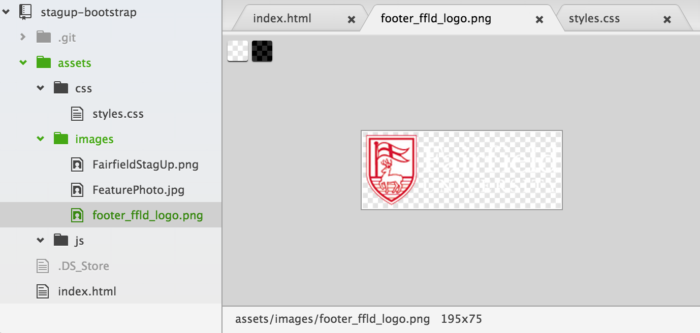

* Open the `index.html` file in Chrome. Scroll to the bottom of the page, right-click on the "Page footer" text, and select `Inspect Element`.

  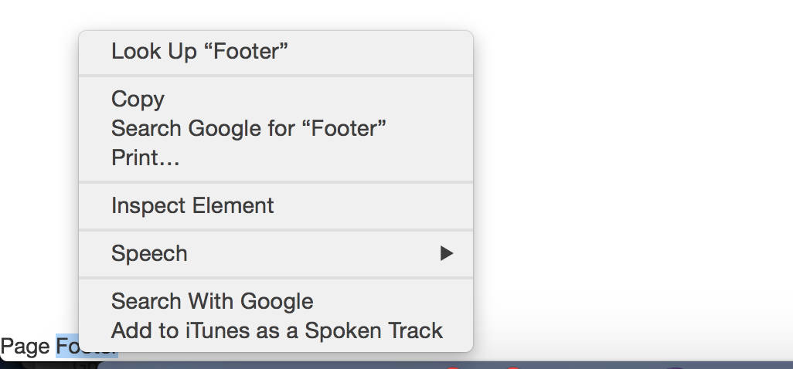

  The Developer Tools will open with the footer selected. (Make sure the `.page-footer` is selected, so that it looks like this.)

  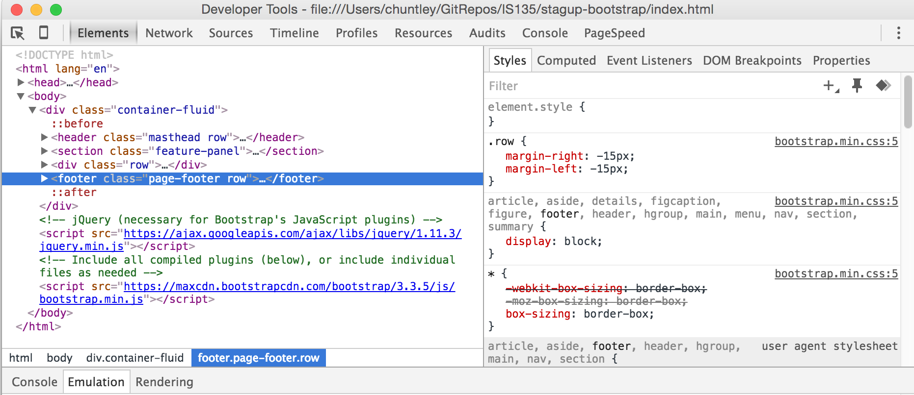

  Besides the HTML on the left, you can also inspect the CSS rules that apply to the element on the right.

* Click on the plus sign (+) in the right-hand CSS panel to create a new CSS rule.

  

  Dev Tools will automatically generate a selector that is more specific than previously-loaded rules. This should allow
  it to win out in CSS's cascading process.

* Click inside the new rule to add a new declaration. Then set the background color to `#333333` and the top-bottom padding to `32px`.

  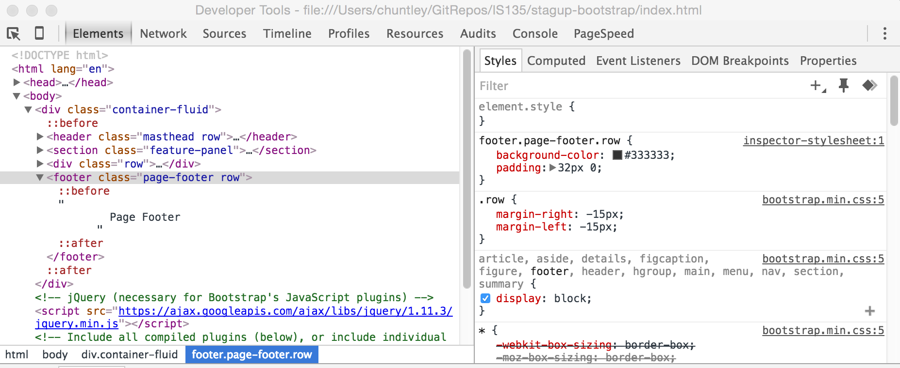

  The footer should turn charcoal gray and expand to allow for the additional padding.

  

* In the left-hand HTML panel click on the triangular arrow-head next to the `.page-footer`. The arrow should point down and the text inside should expand to display the "Page footer" text. We're going to replace the text with the actual footer footer markup.

*  Right-click on the `.page-footer` and select `Edit as HTML`.

  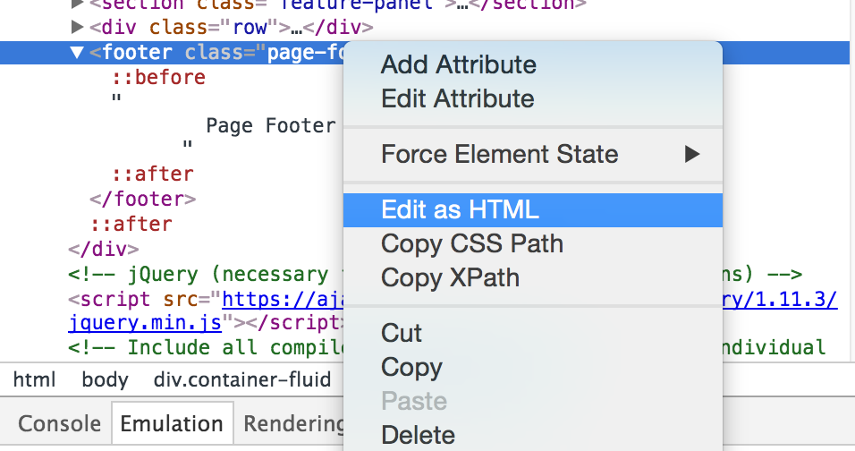

  Then edit the HTML as shown.

  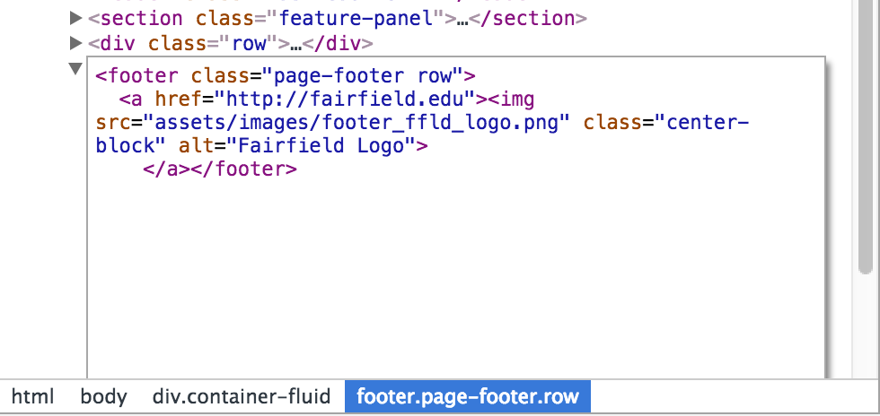

  The logo should appear in the footer. If not, then either i) the `footer_ffld_logo.png` file is not where it is supposed to be; or ii) there is a typo in your HTML.

  > If you were to refresh the page, then you'd lose all of your changes. (Don't test this out. Just trust that it will all disappear.) Fortunately we can copy the HTML and CSS from Dev Tools into Atom. It's all just text.

* In Dev Tool's CSS panel, click on the `inspector-styleheet:1` link.

  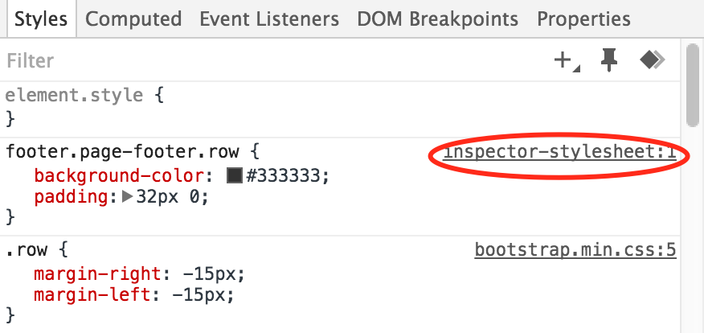

  Your new rule should appear all by itself.

  

  Copy the rule and paste it into bottom of your `styles.css` file in Atom. Just above the new rule add a section comment to indicate that the bottom of the file is for the footer.

  


* In Dev Tool's HTML panel right click on the `a` element that contains the logo image, copy the HTML, and paste it into the corresponding location in the `index.html` file in Atom.

  

* If you preview the `index.html` file in Atom, you should see the logo right where we want it in the footer.

  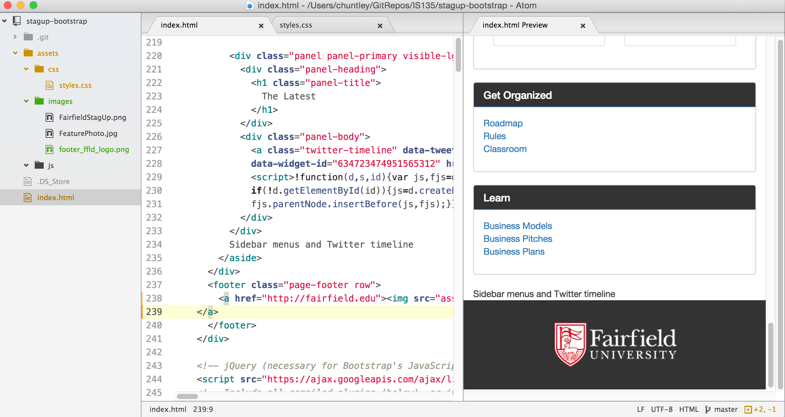

* Once you've got everything copied back into Atom and the preview displays properly, save both the `index.html` and `styles.css` files and refresh the page in Chrome. The page should look exactly as it did in Atom's preview.

* Before we leave the footer, let's see how the Bootstrap's `.center-block` class works. Right-click on the logo in the footer again and inspect it with Dev Tools.

  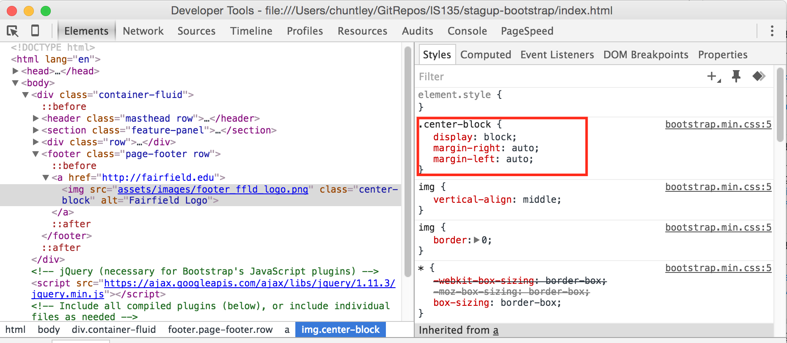

  > It looks like Bootstrap uses the same method shown in the textbook and videos: display the item as a `block` and set the left and right margins to `auto`.

**3. Explore how Bootstrap's Grid works.**  

Bootstrap's Grid System packs a lot of value into a surprisingly few lines of CSS code. It's actually pretty easy to understand once you've mastered the box model, floats, negative margins, and media queries.

* In your browser, inspect the first event in the featured events list.

  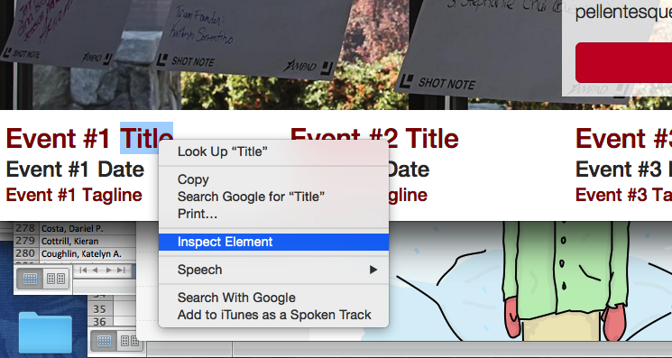

  We're going to use Dev Tools to see how the CSS works on several levels to define the grid. Consider that the ancestry for each grid cell looks like this:

    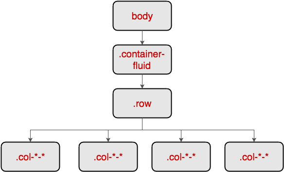

  We'll check out each level to see what we find.  

* Within Dev Tool's HTML panel click the `body` element so we can see if there are any global CSS rules.

  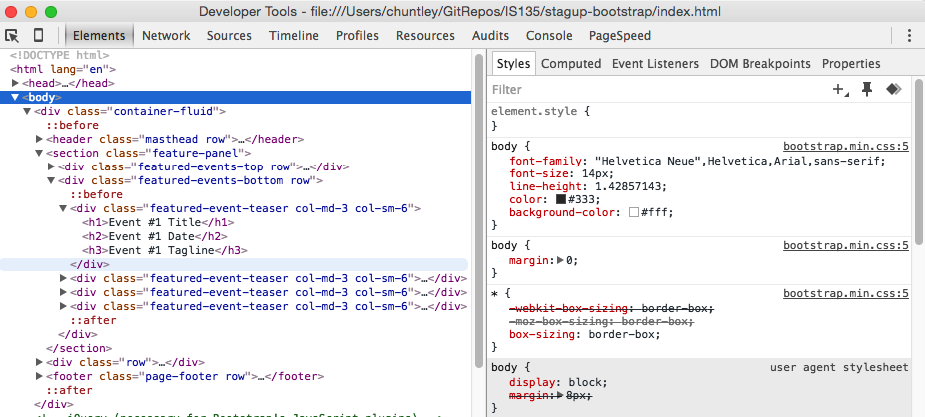

  > So we can see that a wildcard selector is being used to set the box model for *every element* to `border-box`. How convenient!

* Next, click on the `.container-fluid` on the next line to see what that entails.

  

  > Okay, so it looks like `.container-fluid` adds 15px padding on the left and right and then centers the element in whatever space is left.

* Click on the `.row` just below the `.container-fluid`.

  

  > Hmmm. The `.row` class has negative margins, which in effect stretches the row out 15px to the left and right. We'll see why in a second.

* Click on the first `.col-md-3` inside the `.featured-event-teaser`. Recall that `.col-md-3` sets the element to be 3 columns wide on medium-sized (or larger) devices.

  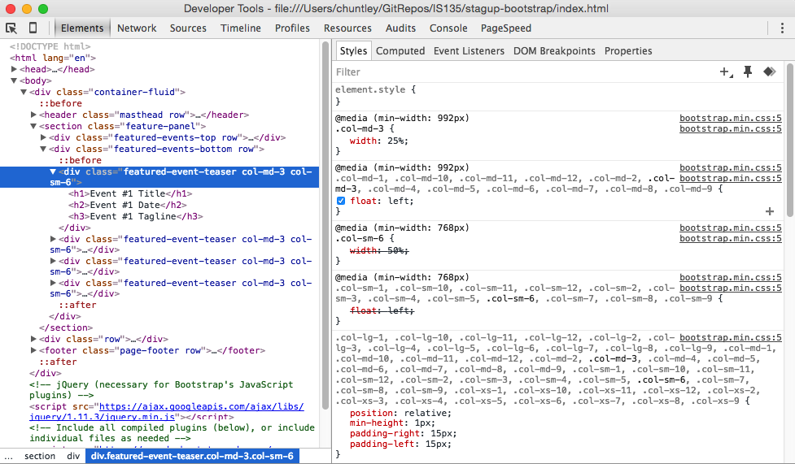

  We see several rules at play for this element:
  * The first media query (for `min-width: 992px` devices) sets the width to 3/12 = 25% of the width of the row. Note: 992 pixels is the `.col-md-*` breakpoint in Bootstrap's grid system.
  * The second media query (for `min-width: 992px` devices) floats the element to the left. This causes the cells to flow left to right along the row. If the float had been to the right then the cells would have flowed right-to-left.
  * Depending on your browser width, you may have two media queries (for `min-width: 768 pixels`) for `col-sm-*`. In the screenshot they are overridden by the media queries above them.
  * Finally, there is a large rule, with selectors for every possible `.col-*-*` class (i.e., every cell in the grid). These set i) the positioning to relative so that it acts as a containing block for any positioned elements inside the cell, ii) the minimum height to 1 pixel so they stay visible even when the cell is empty, and iii) the left and right padding to 15 pixels to provide some whitespace around each cell.

  > The last couple of declarations for the padding are why the `.row` class uses negative margin to stretch itself 15 pixels left and right. The negative margins cancel out the padding on the outer edges of the first and last elements in the row. (You'll want to draw a picture to see why this works.) It's a neat trick but maybe a little too clever. Bootstrap 4 uses an entirely different grid system design that avoids negative margins.

  So that's it. The grid system is really just a few CSS rules that mostly do exactly as you'd expect ... if you understand media queries, margins, padding, floats, and containing blocks.

**4. Make the Navbar fixed to the top of the screen.**  
Fixed navbars, where the menu stays in place at the top or bottom of the viewport with content scrolling "underneath," are becoming pretty common these days. The impetus is the mobile web, where pages tend to be very narrow and long, making a trip back to a navbar at the top of the page inconvenient. So why not just always have it around?

Bootstrap includes support for fixed navbars. [All we have to do is add a class and then make a minor CSS adjustment.](http://getbootstrap.com/components/#navbar-fixed-top)

* Add the `navbar-fixed-top` class to the `.navbar` on line 27.

  ```html
  <!-- Navbar Start -->
        <nav class="navbar navbar-inverse navbar-fixed-top">
  ```

  The content will flow under the navbar, obscuring the top of the image. That's exactly what the [docs] (http://getbootstrap.com/components/#navbar-fixed-top) said would happen.

  

* Add `50px` padding to the top of the `body`. It should now align perfectly.

  ```css
  /*---- Navbar Styling ----*/
  body { padding-top: 50px; }
  .navbar-brand { padding: 6px 15px;}
  ```

**5. Fix the colors on primary buttons.**  

The button at the top of the site appears red when we load the page. However, once the user presses or
even hovers over it, the button turns blue.


Clearly, some combination of the `:hover` and `:active` pseudo-classes must be
setting the background to blue. However, if we try to use Dev Tools to inspect
a button it doesn't show the pseudo-classes. We're going to need to bring out our
Dev Tools ninja skills this time.

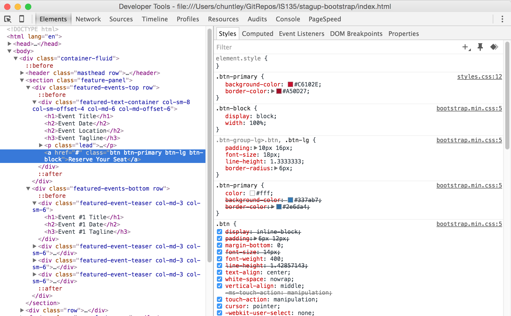

* Click on the push pin icon in the upper right corner of the CSS panel and
toggle the element state to ':hover'. Several new rules should appear. It looks like
the `.btn-primary:hover` turns the colors to blue.

  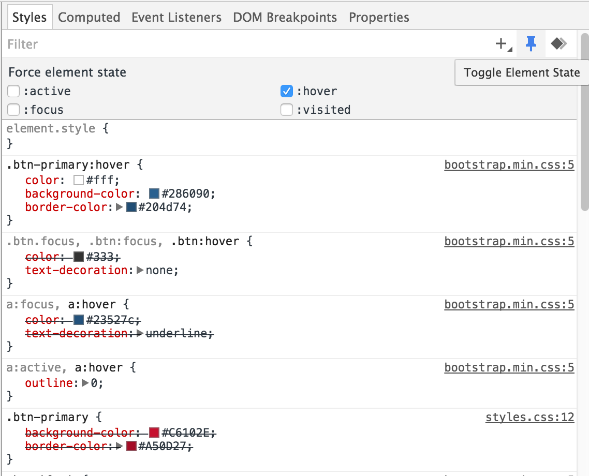

* Add the following rule, which sets the color to a darker shade of red, just below the
existing rule for `btn-primary`.

  ```css
  .btn-primary:hover {
    background-color: hsl(350,85%,35%);
  }
  ```

  > We used hsl(...) instead of a hex color code for convenience. The third parameter can
  be used to create lighter or darker shades of the same color.

* Click on the `:hover` state to toggle it off. The click the `:active` state to toggle it on.
The rules change, now showing a rule for both `.btn-primary:active` and `btn-primary.active`.

  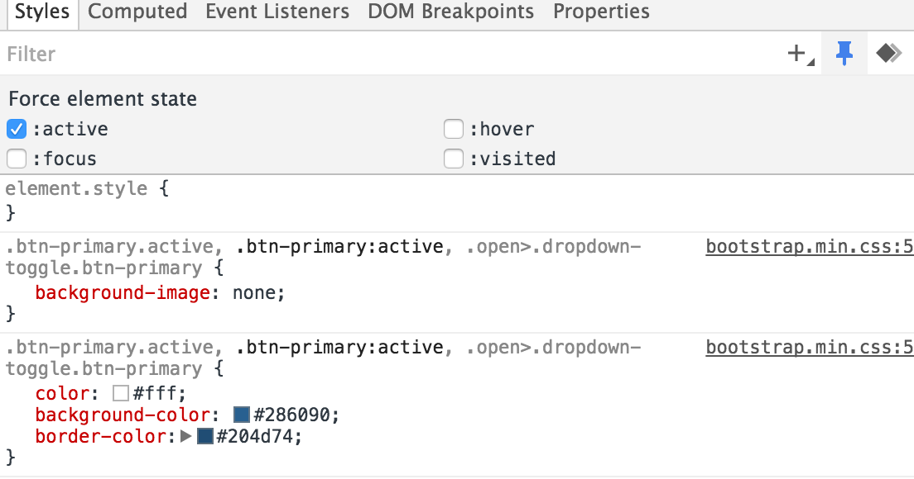

* Add the following rule, which uses an even darker red when the button is active.

  ```css
  .btn-primary:hover {
    background-color: hsl(350,85%,30%);
  }
  ```

  Refresh the browser and then press the button. Oops! It turns blue!

* Toggle the `:hover` state back on. (You should have both the `:active` and `:hover` states enabled.)
Yet more rules appear, this time combining `:active` with `:hover`.

  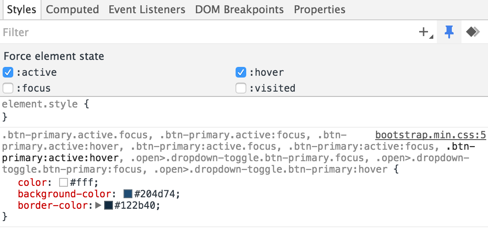

> So, we have to cover both the case where the button is pressed *while* the mouse
is hovering over it, which of course is every time the user presses the button.

* Add the following rule, which handles the requisite combinations of states.

  ```css
  .btn-primary:active:hover, .btn-primary.active:hover {
    background-color: hsl(350,85%,30%);
  }
  ```

**6. Save your work.**  

You're done. Commit and push your work, using the summary comment "Completed part 7".
